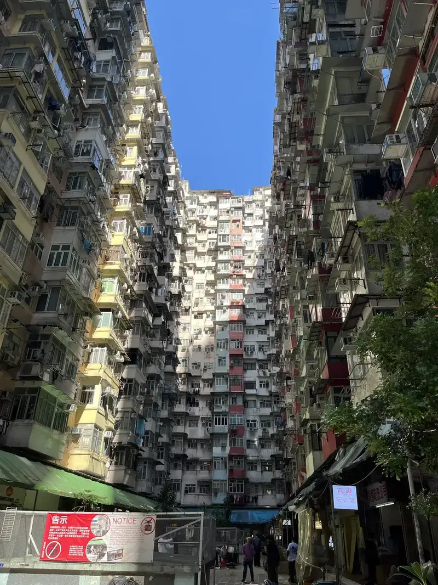

예전부터 좋아했던 사이트인데 여기서 양질의 사진을 무료로 사용할 수 있어서 자주 이용했었다. 라이선스에 대한 잡음이 많았던 기억이 나지만 소비자 입장인 나는 그런 건 잘 몰랐고 잘 사용했다.

양질의 사진은 둘째 치고 이 사이트를 보면 이미지 최적화가 정말 잘 돼 있다. 지금까지 내가 본 사이트 중 가장 완벽하고 이상적이다. 1픽셀도 오차 없이 정확한 크기의 이미지를 AVIF 형식으로 제공하고 브라우저 크기에 따라 그리드 컬럼 갯수가 달라지는 반응형 구조임에도 불구하고 설계를 정말 잘 해놓았다.

핀터레스트도 잘 되어 있었던 것으로 기억하는데 조금은 옛날 방식인 x2, x3 같은 방법을 사용했었고 AVIF는 아니었던 것 같다.

Mdit에 노션처럼 Unsplash 이미지를 쉽게 삽입할 수 있게 할 생각이다. 예전에 구현해본 적이 있어서 어렵지는 않지만 API 이용 약관에 이미지 출처를 꼭 명시하도록 되어 있어 이미지 캡션에 작가 이름과 링크를 수정할 수 없게 할 수밖에 없다. 그런데 사용자가 임의로 마크다운 파일을 수정한다면 막을 수가 없는데 약관에 위배될까?

오랜만에 Unsplash 컬렉션을 살펴보니 이런 사진이 있었다. 기억은 나지 않지만 2018년 말, 수능이 끝난 뒤 시간인 걸 보니까 이런 사진을 저장하며 세계 여행을 꿈꿨던 것 같다. 이런 모습을 보면 내 안에 모험 DNA가 새겨져 있는 듯하다.

근데 magick으로 일일이 사이즈를 줄이고 WebP로 변환해서 넣고 있는데 너무 불편해서 미치겠다. 옵시디언 플러그인 중에 비슷한 것을 찾아보고 응용해서 적용해봐야겠다.
