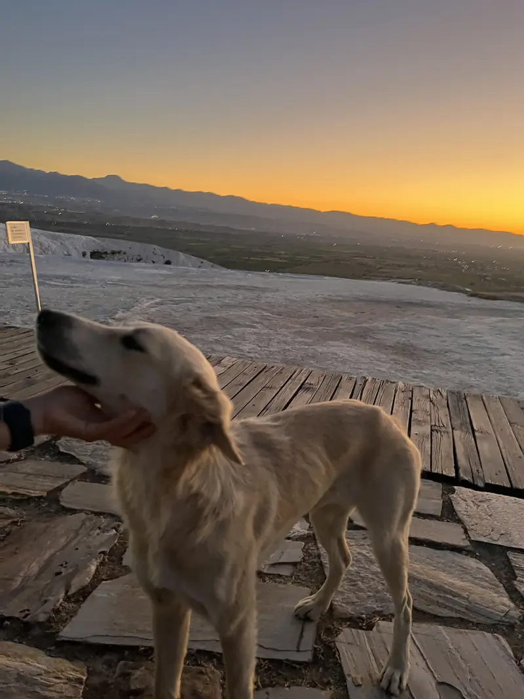

> 소재 고갈이다 큰일이다

사실 쓸 얘기는 많지만 좀 가벼운 걸로만 쓰고 싶어서 뭘 쓸지 고민이다.

### 립밤

근 한달간 입술이 계속 트는데 왜 자꾸 립밤 바르는 걸 깜박할까

### 이미지 처리

어제 이미지 변환하는 게 불편하다고 했었는데 오늘 추가했다. 한 번 써봐야지.

알고 보니 HEIC 파일은 변환이 안 된다. 내일 고쳐야겠다.

### Ollama Cloud

라는 게 있더라? 나의 맥미니 24GB를 고통에서 해방시켜 줄 수 있게 되었다. 그냥 가끔 쓰는 용도로는 무료도 충분할 것 같다. 이걸로 재미있는 걸 많이 만들 수 있겠다는 생각.

### Mdit 디자인 개편과 작은 디테일

디자인이 별로인 부분이 많이 보여서 계속 다른 레퍼런스를 보면서 생각 중이다. 그리고 파일 탐색기 부분을 전면 리팩토링 해야 하는데 좀 무섭다. 지금 코드는 너무 더러워서 폴더 내 파일 변경 감지 기능을 쉽게 추가하지 못하고 있다.

### 마음이 조금은 편해졌다

기냥 막 살고 있다. 그러니까 마음이 편하다.

### 영어 공부

영어 공부를 시작했다. 원래도 영어를 자주 접하긴 했는데 공부 모드로 들어가는 건 오랜만이다.

### 코딩

뭔가 개발자로 살기보다는 코딩은 취미로 남겨두고 싶은 마음이 있다. 그런데 지금은 잘 하는 게 딱히 없어서 어쩔 수가 없다. 다른 무언가를 잘해보고 싶은 욕심이 있다.

### 릴스

원래 인스타를 잘 안해서 릴스도 안 봤는데 이제는 좀 보려고 한다.

### 끝.

​
