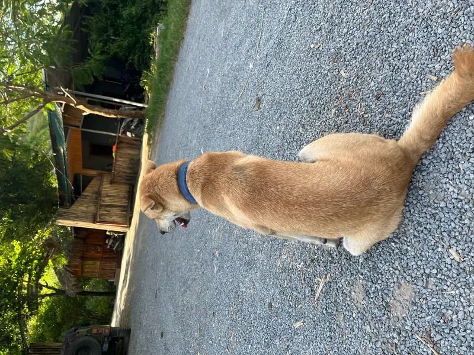

## 맥 OS 업그레이드 함

얼마 전 세콰이어에서 타호로 업그레이드했는데 오히려 다운그레이드된 느낌이다. 푸릇푸릇한 색감은 괜찮지만 오브젝트 모서리가 지나치게 둥글다. 너무 둥글어서 거부감이 든다. 애플이 디자인 트렌드를 선도한다는 건 알지만 변동이 너무 급격해서 적응이 어렵다.

그리고 디자인에 시각 효과를 과하게 적용한 탓인지, 일부 구간에서 렉이 발생하는 것이 눈에 띈다.

어쨌든 모서리만 조금이라도 덜 둥글었으면 좋겠다는 생각이 든다.

## 맥북 살 예정

원래 이번에 여행 갈 때는 아무것도 안 챙기려고 했는데 욕심이 생겨서 노트북을 하나 가져가야겠다는 생각이 들었다. 맥북 에어 M2 램 16GB 256GB SSD 모델을 고려하고 있다. 개인적으로 중고는 싫어서 새 제품을 사려면 약 100만 원 정도가 필요하다.

그래서 내가 애정하는 엔비디아 주식 약 50만원 정도를 처분하려고 한다. 어쩔 수가 없다.

## Polar Payout

Mdit으로 번 수익을 처음으로 내 계좌로 뺐다. 얼마 되지 않은 돈이지만 알바 제외하고 처음으로 번 돈이니까 부모님께 내복 사시라고 보냈다. 앞으로는 당장 내 입에 풀칠하기 위해 번 돈을 내가 써야겠지만, 돈은 나보다는 다른 사람을 위해 혹은 같이 쓸 때 가장 의미가 있는 것 같다.

## HEIC 지원

이번에는 진짜다. WebP로 변환되면서 돌아갔기는 했지만.

## 티끌 모아 만원

생활비를 한 푼이라도 벌어보자는 취지에서 요즘은 강제로 8000보를 매일 걷고 있다. 그래서 어제 총 만원을 모았다. 사실 틱톡도 매일 출첵해서 80원씩 벌고 있다. 열심히 살자.

​
