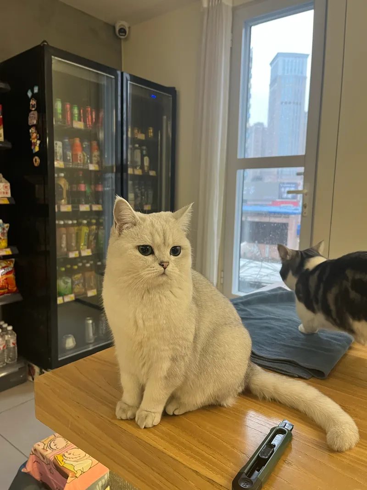

아침 비행기는 조금 지연됐다. 자느라 정신없어서 상관은 없었다.

옌타이에 도착했더니 비가 오고 있었다. 공항버스를 타러 갔는데 안내해 주시는 분이 정말 친절하셨다. 내 위챗 앱을 이리저리 만지더니 알아서 결제해 주셨는데 혼자 했으면 절대 못 했을 것 같다.

이어서 숙소 체크인을 하러 갔더니 엄청 일찍 해주신 건 물론 미치게 귀여운 고양이까지 있었다..!

9000원짜리 도미토리인데 깔끔하고 시설도 정말 좋다. PC방같은 시설도 있는데 지금 하루 종일 게임만 하고 있는 사람들도 있다.

그래도 이 동네에는 딱히 할 게 없어 보여서 그냥 동네를 돌아다니며 밥이나 음료를 사 먹고 쇼핑몰만 세 군데 돌다 왔다. 내일 오후 5시에 기차를 타야 하는데 그전까지 근처 관광지나 조금 둘러보고 바로 떠날 생각이다.

그래도 짧은 하루동안 많은 걸 보고 듣고 배웠는데 간단하게 정리해보자면

* 푸세식 화장실?? 좌변기가 안 보인다. 큰 쇼핑몰에 가야 8사로 중 하나꼴로 있음
* 길거리 음식 가격이 엄청 저렴하다. 최소 한국에 비해 2\~3배 싼 듯 하다.
* 비가 와서 신발이 조금 젖었더니 내 발 냄새가 편견 속 중국인들 냄새보다 독하다. 그런데 사람들이 잘 안 씻는 건 맞는 것 같다. 아직 오후 9시밖에 되지 않았지만 샤워실은 아직 나만 이용한 것 같은 느낌이 든다.
* 식당에서 말레이시아 화교 가족을 만났는데 그 중 한 어르신의 중화사상이 상당히 강하셨다. 한자 > 알파벳, 자꾸 우리 조상들이 한자를 썼다는 걸 말하신다.
* 도시 규모나 인구로 보았을 때 옌타이가 그리 큰 것 같지는 않은데 쇼핑몰 규모가 엄청나게 크다. 스타필드급 쇼핑몰이 근처에 여러 군데 있는 것 같다. 왜일까?
* 쇼핑몰 식당가에서 직원 구인 공고를 봤는데 월급이 100만 원 정도 되는 것 같다. 확실히 한국의 최저 시급과 비교해 보면 물가나 월급이 5분의 2 정도 되는 느낌이 있다. 다만 이 지역만 그런 것일 수도 있고 다른 대도시에 가면 더 높을 것 같긴 하다.
* 사람들이 은근히 조용하다. 그런데 전화만 하면 눈치를 전혀 안보고 큰 목소리로 통화하는 신기한 특징이 있다.
* 옌타이에는 한글이 은근 많이 보인다.
* 샤오미 매장에 보조배터리랑 전기면도기를 사러 갔는데 바가지를 쓴 것 같다. 아무 생각 없이 결제하고 나왔는데 2만 원 정도 더 낸 것 같은 느낌이 든다.
* 유니클로는 한국 매장 가격보다 30% 정도 더 비싼 것 같다. 신기하다.
* 평일 저녁인데도 쇼핑몰 식당에서 식사하는 인원이 한국보다 많은 것 같은 느낌이다. 이런 걸 보면 내수 시장이 살아있다는 뜻일까?

암튼 내일도 여행 재밌게

​
