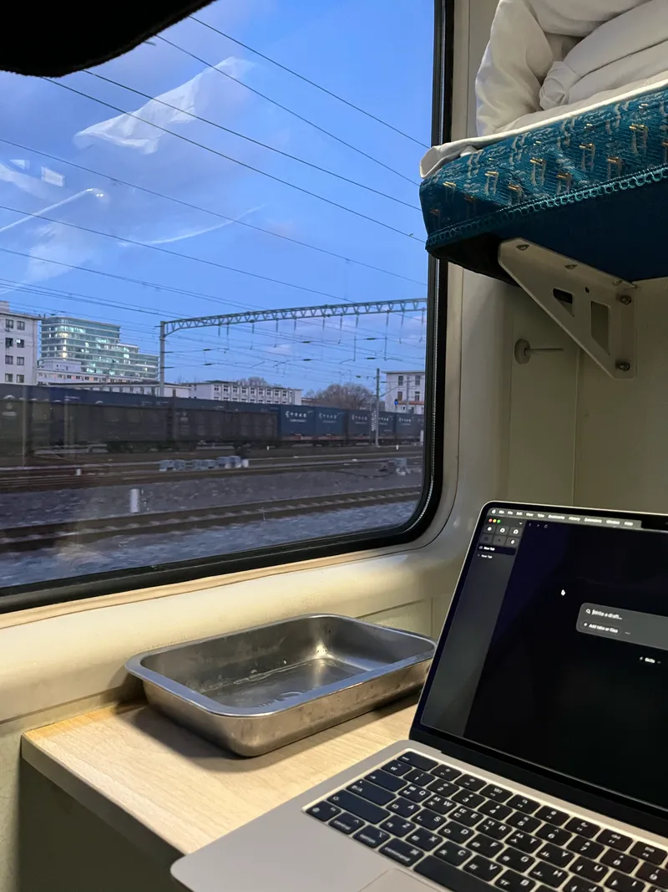
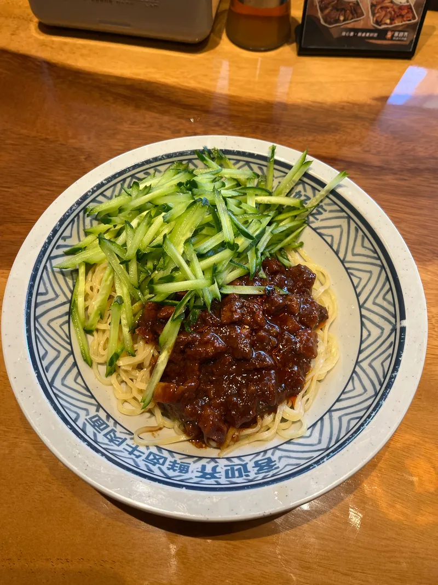

지금 시각은 오후 6시 반, 옌타이역에서 기차를 타고 정저우로 향하는 중이다.&#x20;

근데 집중은 잘 안되는 것 같아서 조금만 하고 지금 이렇게 글을 쓰고 있다.

지금 기차는 너무 낭만 있고 좋은데, 밤기차라 바깥 풍경이 잘 안 보여서 조금 아쉽다. 그리고 아직 사람들이 많이 안 타서 왁자지껄한 분위기가 안 나는 것도 조금 아쉽다.

오늘 옌타이는 만족스러웠다. 여러 박물관과 옛 마을도 가 보았다. 그런데 너무 상업화되어 있는 게 우리나라 관광지와 느낌이 비슷했다.

자기 전에 흑백요리사 다 보고 잘 생각인데 너무 설렘 ㅎ히. 어떻게 해야 재미있게 여행할 수 있는지 배우는 중 🚆

​
