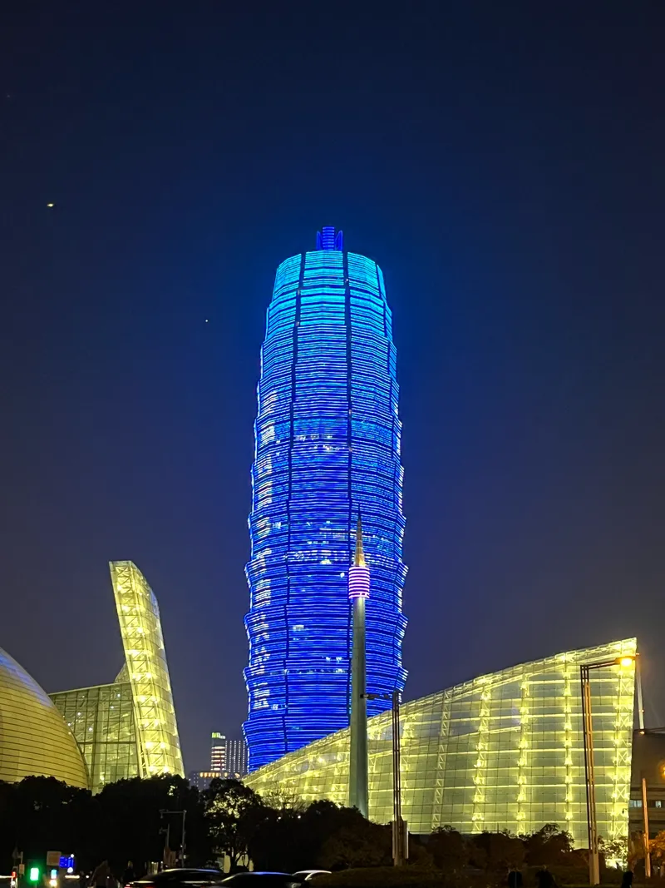

메리 크리스마스! 인데 여기는 그다지 크리스마스에 의미를 두는 것 같지는 않다. 공휴일도 아닌 것 같기도?

그나저나 어제 기차에서\<흑백요리사>를 보던 중, 칭다오 근처에서 한 친구가 탔고 내 앞 침대에 앉았다. 앉자마자 말을 걸더니 한국인인 걸 알고는 바로 '기차에서 만난 한국인' 컨셉으로 틱톡까지 찍혔다. 부끄러웠는데 신기한 경험이라서 그냥 즐겼다.

그리고 두 시간 동안 이것저것 얘기하면서 내 야매 중국어 50%, 번역기 25%, 영어 25%로 엄청 시끄럽게 떠들었다. 사실 같은 칸에 탔던 중국인들은 엄청 조용하던데 어글리 코리안답게 아랑곳하지 않고 10시까지 얘기를 나눴다.

여러모로 많은 걸 알게 된 시간이었다. 내 중국어 실력은 형편없었지만 그럼에도 어느 정도 알아듣는다는 게 마음에 들었다. 마침 그 친구도 여행을 정말 좋아해서 얘기가 잘 통했다.

밤 기차는 꽤나 추웠다. 이불을 얼굴까지 뒤집어써야 그나마 살 만했다. 그리고 열차 통로에서 어찌나 담배를 피워대던지 밤새 담배 냄새와 이불에서 나는 꾸릿한 냄새를 맡으며 잠을 청해야 했다.

정저우는 진짜 할 게 없어 보였다. 지하철을 타고 곧바로 숙소로 왔고 체크인 시간 전까지 코딩하며 시간을 때웠다. 그런데 도시는 엄청 큰 것 같았다. 도로도 널찍하고 여기는 오토바이나 자전거 도로가 무척 잘 되어 있다. 그럼 뭐 함.

중국은 쇼핑몰이 굉장히 많고 규모도 정말 큰 것 같다. 그리고 옥수수 빌딩도 밤에 조명이 켜지면 꽤 볼만하다. 호스텔도 말도 안 되게 저렴하고 깔끔하다. 그리고 대도시라 그런지 몰라도 사람들이 줄도 잘 서고 조용하다. 그냥 우리가 가진 편견을 조금은 없앨 필요가 있어 보인다. 그런데 분명히 미세먼지는 딱히 안 많아보이는데 밖에 나갔다 오니까 목이 컬컬함.

호스텔 휴게실에서 누가 자꾸 마이크로 크게 노래부르는데 너무 못 불러서 내가 가서 대신 불러주고 싶다ㅏ

​
